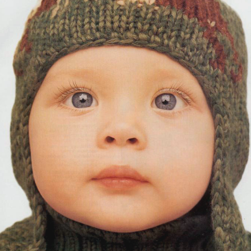

# SRCNN in Tensorflow

Tensorflow implementation of **Image Super-Resolution Using Deep Convolutional Networks**.

*GT* | *Bicubic* | *SRCNN* 
:---: | :---: | :---: |
 |  |  

## Implementation Details

Our implementation used TensorFlow to train SRCNN. We used almost same methods as described in the paper. We trained the network with 91-image dataset and validated with Set5 dataset while training. At test time, to get the same result size for up-scaling factor 2, 3 and 4, we cropped the test image with 12, which is the Least Common Multiple. Also, we padded border of the ground truth and bicubic interpolated test image by 6 to make same size with SRCNN result. 

According to the paper, the best performance on Set5 with upscaling factor 3 is the average PSNR value of 32.75dB with filter size 9-5-5 and ImageNet training dataset, but we were **aim to 32.39dB** which is the demonstrated average PSNR value when the model is trained with 91-image dataset, 9-1-5 filter size and Y only. After training 12,500 epoch, we got the same value to the paper, **32.39dB**.

Pretrained-model with 91-image training dataset and up-scaling factor 3 is given.

Note that we trained and tested with Y-channel. If you want to train and test with 3-channels (YCbCr or RGB), you may add or implement some type-casting code.

## Installation

```bash
git clone https://github.com/jinsuyoo/SRCNN-Tensorflow.git
```

## Requirements

You will need the following to run the above:
- Tensorflow-gpu
- Python3, Numpy, Pillow, h5py, tqdm

To install quickly, use `requirements.txt`. Example usage:
```bash
pip install -r requirements.txt
```
Note that we run the code with Windows 10, Tensorflow-gpu 1.13.1, CUDA 10.0, cuDNN v7.6.0 

## Documentation

To pre-process the train and test dataset, you need to execute the Matlab code.

For those of who cannot execute the Matlab code,

Click [here][data] to download the pre-processed training data with 91 dataset. Put the file under SRCNN-Tensorflow directory.

The pre-processed test data with Set5 and Set14 is provided.

### Training SRCNN
Use `main.py` to train the network. Run `python main.py` to view the training process. Training takes 7-8 hours on a NVIDIA GeForce GTX 1050. Example usage:
```bash
# Quick training
python main.py

# Example usage
python main.py --train_dataset=YOUR_DATASET \
    --use_pretrained=False \
    --epoch=1000 \
    --scale=4 \
```

### Testing SRCNN
Also use `main.py` to test the network. Pretrained-model with 91-image training dataset and up-scaling factor 3 is given. Example usage:
```bash
# Quick testing
python main.py --is_training=False \
    --use_pretrained=True

# Example usage
python main.py --is_training=False \
    --use_pretrained=True \
    --test_dataset=YOUR_DATASET \
    --scale=4
```
  
Please note that if you want to train or test with your own dataset, you need to execute the Matlab code with your own dataset first :)

## Results

### The average results of PSNR (dB) trained with up-scale factor 3

*Code* | *Dataset* | *Scale* | *Bicubic* | *SRCNN*
:---: | :---: | :---: | :---: | :---: |
**SRCNN** | Set5 | 3x | 30.39dB | 32.39dB
**SRCNN-Tensorflow**| Set5 | 3x | 30.38dB | 32.39dB

### Some of the result images

*GT* | *Bicubic* | *SRCNN* 
:---: | :---: | :---: |
 |  |  
 |  |  
 |  |  
 |  |  


## References

- [Official Website][1]
    - We referred to the original Matlab and Caffe code.

- [tegg89/SRCNN-Tensorflow][2]
    - We highly followed the structure of this repository.

[data]: https://drive.google.com/file/d/1yvQYDYKCrTNxtvkOAHpTFOapEDyji0RR/view?usp=sharing
[1]: http://mmlab.ie.cuhk.edu.hk/projects/SRCNN.html
[2]: https://github.com/tegg89/SRCNN-Tensorflow